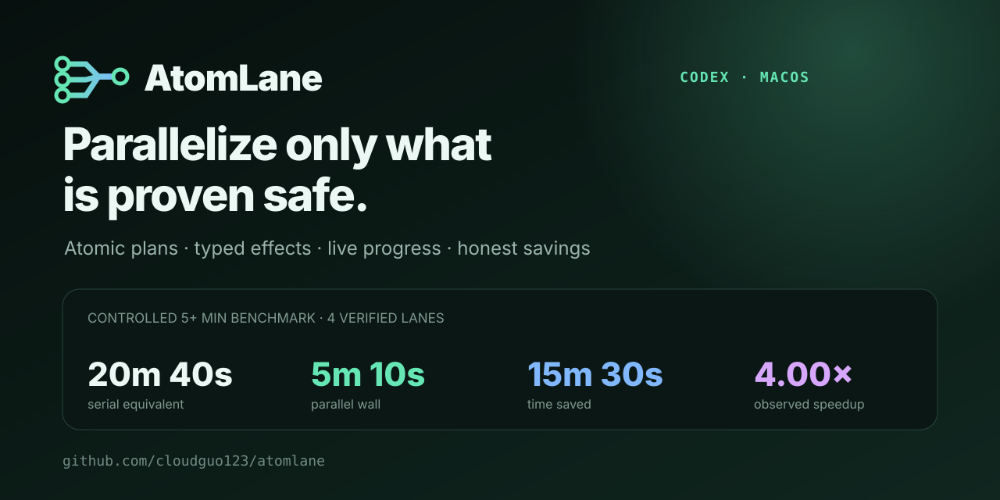
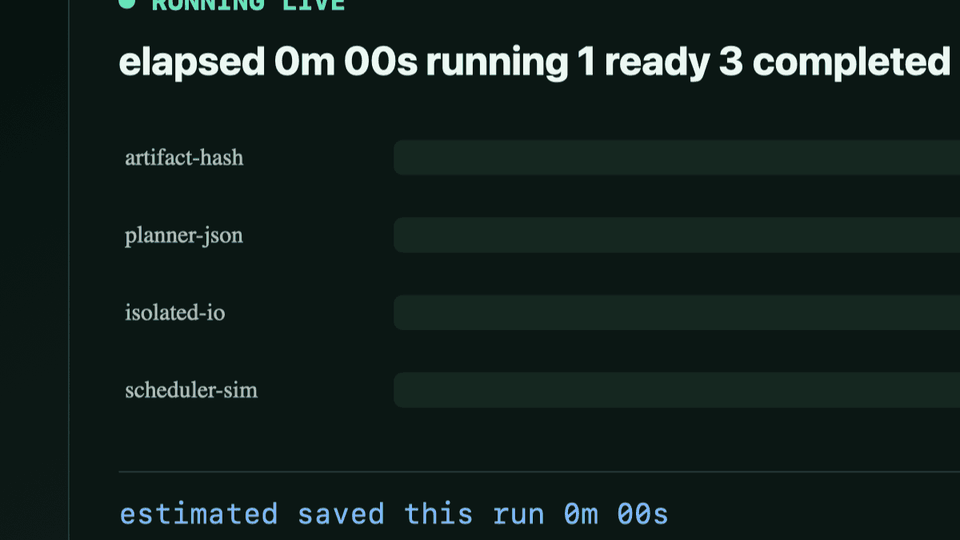

# Mac Parallel Accelerator

**让 Codex 在 macOS 上更快完成构建、测试、Docker 和科研流水线，同时不破坏任务语义。**

[](https://github.com/cloudguo123/mac-parallel-accelerator/actions/workflows/ci.yml)
[](https://github.com/cloudguo123/mac-parallel-accelerator/actions/workflows/github-code-scanning/codeql)
[](https://github.com/cloudguo123/mac-parallel-accelerator/actions/workflows/long-benchmark.yml)
[](https://cloudguo123.github.io/mac-parallel-accelerator/)

[English](README.md) · [在线报告](https://cloudguo123.github.io/mac-parallel-accelerator/) · [反馈首次运行](https://github.com/cloudguo123/mac-parallel-accelerator/issues/new?template=first-run.yml) · [提交实测结果](https://github.com/cloudguo123/mac-parallel-accelerator/issues/new?template=benchmark.yml)



## 两条命令安装

```bash
codex plugin marketplace add cloudguo123/mac-parallel-accelerator
codex plugin add mac-parallel-accelerator@mac-parallel-accelerator
```

安装后新建一个 Codex 任务，然后直接说：

```text
使用 $accelerate-local-work 扫描这个项目，把确认安全的工作并行执行。
全过程实时显示进度，并报告本次和累计节约时间。
```

要求：macOS、支持插件和 MCP 的 Codex、Python 3.10+。只有分析 Compose YAML 时需要 Ruby；只有重新构建浏览器指示器时需要 Node.js 20+。

仓库还通过根目录的 `plugin.json`、`skills/` 与本地 stdio `mcp.json`
兼容厂商中立的 [Agent Plugins 1.0.0](https://agent-plugins.org/) 标准；
Codex 原生客户端仍使用 `.codex-plugin/plugin.json` 和 `.mcp.json`。

## 它解决什么问题

普通的“并行执行”经常只是拆分命令文本，容易改写 `&&` / `||` 的控制流，争用 `.next`、JUnit、数据库、Docker 卷或 Git 状态，叠加内部线程池，并且执行过程中只看到空白等待。

本插件先把任务编译成带类型的 Atom IR，再判断哪些原子任务可以同时运行。未知副作用、多写入者、过期源快照、不支持的服务生命周期和被篡改的计划都会拒绝执行，而不是猜测。

## 典型场景

| 项目场景 | 优化目标 | 关键安全边界 |
| --- | --- | --- |
| Web / TypeScript | 质量门禁、包图、浏览器矩阵 | 保留成功条件；隔离 `.next`、coverage、JUnit 和缓存 |
| Docker / Compose | 多镜像构建、健康检查 DAG、测试矩阵 | 约束 VM CPU/内存、端口、卷、就绪事件和迁移 |
| 科研 / 论文 | 数据准备、验证、出图、文稿构建 | 推断数据依赖，保护正式计时和来源证据 |
| 原生构建 / 测试 | Make、编译器、测试运行器 | 优先委托原生并发，统一预算内外层 worker |
| 媒体 / 数据 / ML 批处理 | 多输入并行、确定性合并 | 要求输出隔离、资源有界、合并语义明确 |

内置场景目录已覆盖 50 多类软件工程、科研、容器、媒体、机器学习、发布、数据库以及底层 CPU/GPU/I/O 优化目标。

## 真正实时显示



超过十秒的任务通过 PTY runner 运行，持续显示：

```text
已运行 2分15秒 · 运行中 4 · 就绪 2 · 已完成 7 · 失败 0
本次预计节约 4分31秒 · 累计节约 19分52秒
```

结束后还会核对每个原子任务的状态、返回码、超时、跳过原因、输出截断、峰值并发、本次节约和累计节约。

## 五分钟以上公开基准

保留的公开实测通过真实并行执行器运行四个隔离的低负载任务，每个任务都超过五分钟：

| 指标 | 结果 |
| --- | ---: |
| 并行实际用时 | **5分10秒** |
| 串行等效用时 | **20分41秒** |
| 本次节约 | **15分31秒** |
| 观测加速比 | **4.00×** |
| 并行效率 | **100.0%** |

串行等效时间是四个独立任务实测时长之和，并没有为了展示数字再串行重复执行 20 分钟。这个受控测试验证了调度、实时显示和统计开销，不代表所有真实项目都能获得 4 倍加速。请查看[完整可视化报告](https://cloudguo123.github.io/mac-parallel-accelerator/)、[原始 JSON](https://cloudguo123.github.io/mac-parallel-accelerator/benchmark-results.json)和[基准规范](BENCHMARKING.md)。

## 核心安全契约

```text
atomic_task_plan
  → 完整且不可变的 compiled_plan + plan_hash
  → atomic_exec 原样执行同一个对象和哈希
```

插件不会把编译结果再翻译成手写并发波次。成功、失败、顺序、数据、流、就绪、健康、完成和清理依赖保持不同类型；文件、副作用、容量资源、生命周期和源快照都属于执行契约。

## 隐私与权限

- 项目和可选 trace 扫描都在本地、有明确边界。
- trace 只返回聚合路由信号，不返回提示词、推理、命令正文或工具输出。
- 并行只改变时间，不扩大权限；不会凭空授权远程操作、破坏性清理或重试。
- 运行结果不会自动上传；分享必须由用户明确触发并可先审阅。

## 一起完善

请先在一个真实任务上试用，再提交脱敏后的实测结果。即使没有加速、而是被安全规则拦住，也很有价值——它能告诉我们下一条需要补齐的语义规则。

[反馈首次运行](https://github.com/cloudguo123/mac-parallel-accelerator/issues/new?template=first-run.yml) · [提交实测](https://github.com/cloudguo123/mac-parallel-accelerator/issues/new?template=benchmark.yml) · [参与讨论](https://github.com/cloudguo123/mac-parallel-accelerator/discussions) · [查看路线图](ROADMAP.md) · [贡献代码](CONTRIBUTING.md)

[MIT 许可](LICENSE) · [隐私说明](PRIVACY.md) · [使用条款](TERMS.md)
